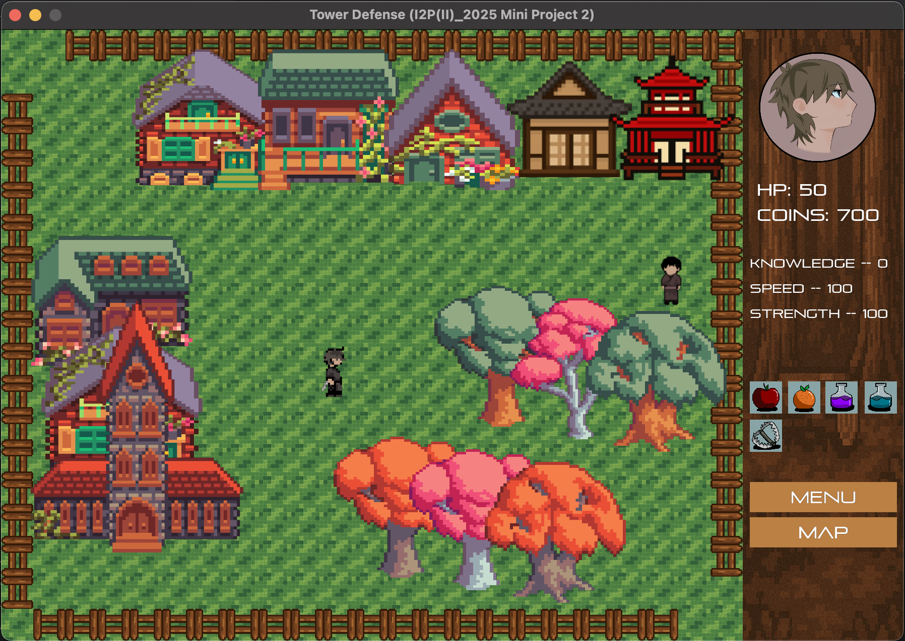
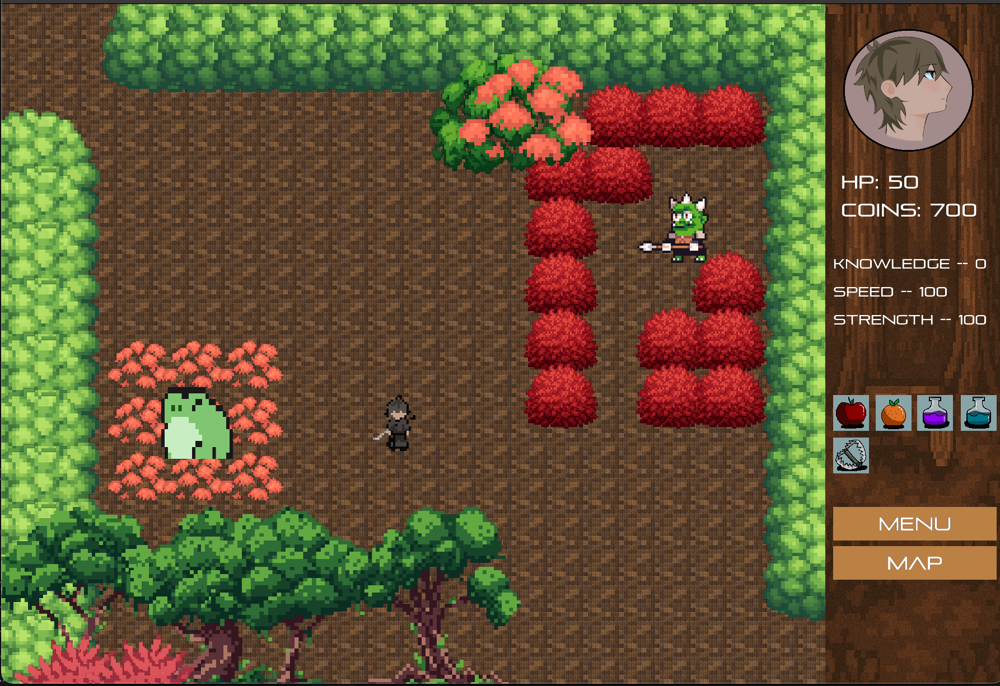
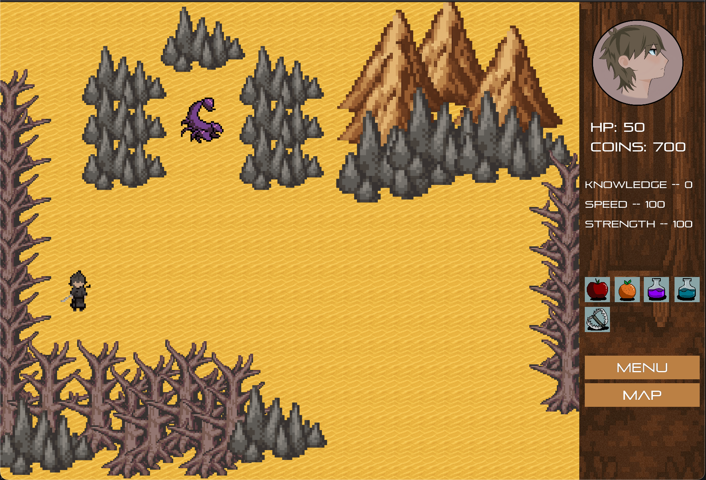
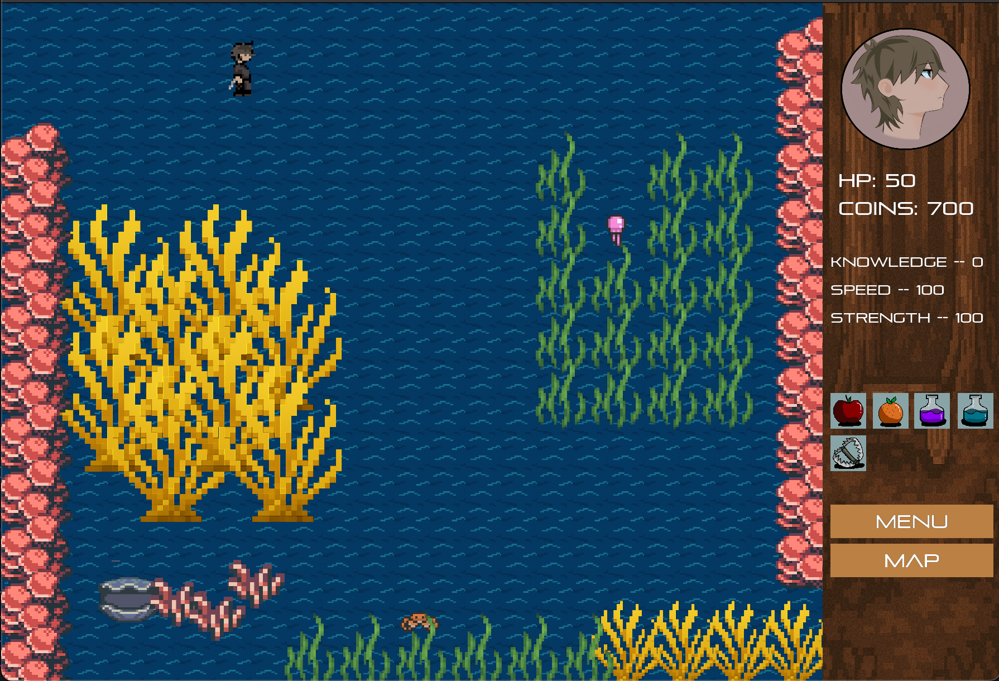

# Turn-Based RPG: The Outlander's Mission

A fantasy turn-based game + RPG hybrid developed using **C++** and **Allegro 5**.  
Players embark on a quest to save Princess Sayuki, navigating through hand-drawn levels, battling enemies in turn-based combat, and customizing maps with a built-in editor.

---

## Features

### [Easy]
- **Player Core Mechanics**
  - Movement and collision system.
- **Turn-Based Combat**
  - Actions: attack, defend, heal, use items.
- **Basic Enemy AI**
  - Patrol behavior, pursuit on sight, and trigger-based events.
- **Local Account System**
  - Save/load player progress, including health, money, and knowledge.

### [Medium]
- **Physics Simulation System**
  - Gravity, friction, knockback effects.
  - Projectile motion with arc-based trajectories and hit detection.
- **Sprite Animation & Visual Effects**
  - Smooth sprite-based animations for characters and enemies.
  - Visual polish including hit particles and scene transitions.
- **Mini-Map & HUD**
  - Minimap for explored areas.
  - HUD displays player health, stats, and combat actions.

### [Hard]
- **Procedural Map Generation**
  - Randomized elements like enemy waves and damage helpers based on difficulty.
- **In-Game Map Editor**
  - Paint terrain, place objects, and customize encounters.
- **Art & Storyboard Integration**
  - Fully hand-drawn characters, enemies, tilesets, and biome backgrounds.
- **Version Control Workflow**
  - Git-based team collaboration with `main`, `dev`, and `feature/*` branches.

---

## Individual Contributions

### 113006201 Angelie Melisa 宋琴 (50%)
- Core gameplay logic (player movement, physics, projectile system)
- Combat engine & turn-based actions
- Procedural level generator & in-game map editor
- Local account/profile system
- Sprite animation integration & visual feedback effects
- Git version control structure and team workflow
- Overall scene flow, map transition, and debugging

### 113006233 Shenice Mau 毛嬉𡟯 (50%)
- Multiple art assets (main character, NPCs, enemies, tilesets, props)
- UI mockups, HUD layout, and visual polish
- Storyboard design and narrative art scenes
- Mini-map visuals and icon designs
- Packaging final build and gameplay video capture
- Game data integration

---

## Game Controls
- **Arrow Keys / WASD** – Move
- **Space** – Interact with dialogues
- **Enter** – Confirm in menus
- **Mouse** – Place items, use map editor tools

---

## Gameplay Preview

  
  
  
  

---

## Gameplay Video

[Watch on YouTube](https://www.youtube.com/watch?v=0TviIqtmWdY)

---

## Special Thanks

**Professor 郭柏志**, for the valuable knowledge and support shared during and beyond I2P(II) lectures.
